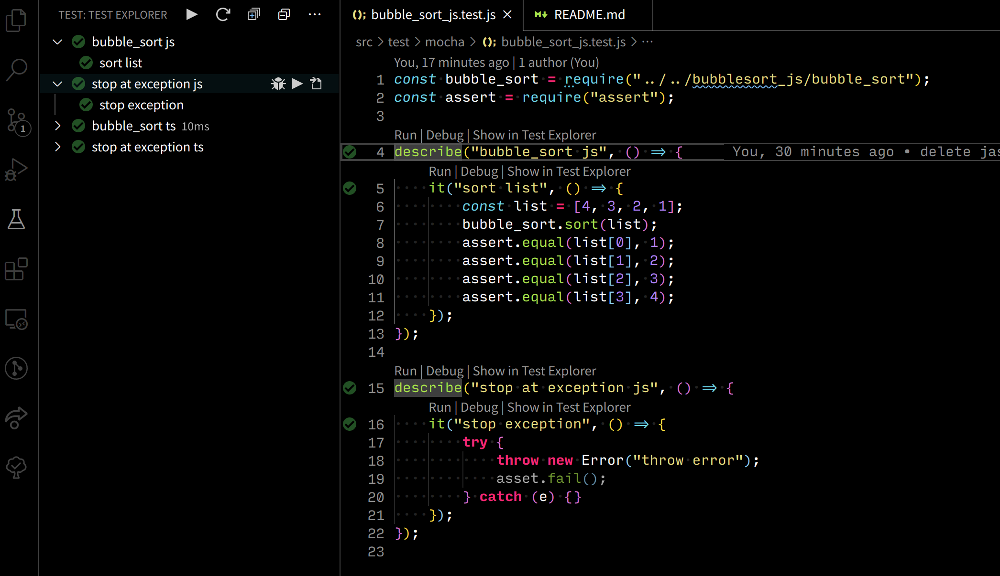
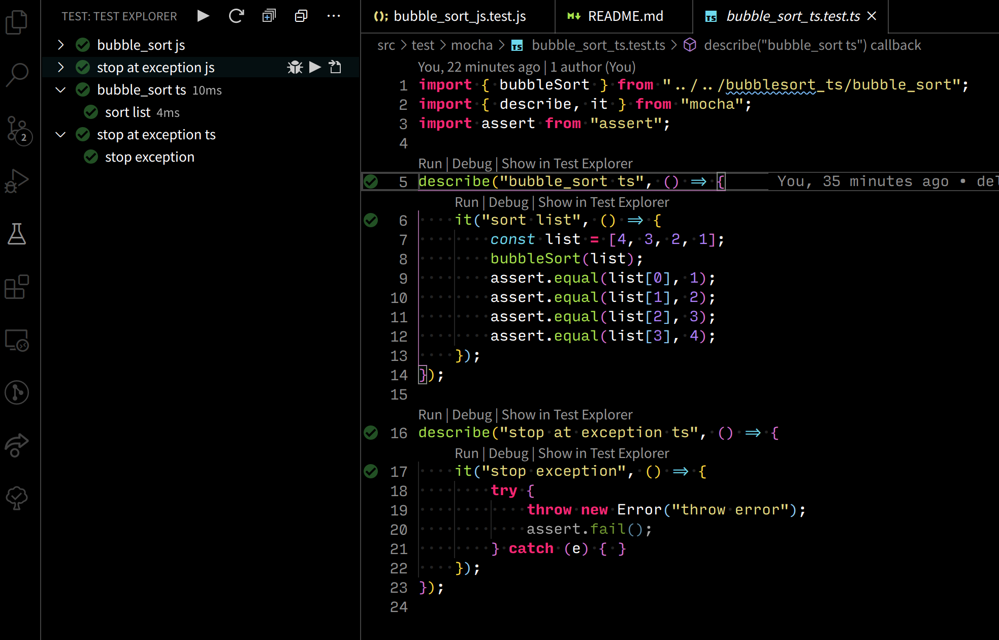
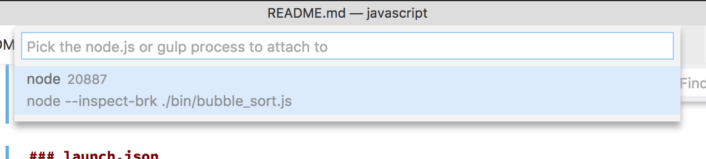

# How to Debug ServerSide JavaScript(NodeJS) and TypeScript with VS Code

## Summary

- [Basic](#basic)
- [Spec](#spec)
- Unit Test:
  - [mocha](#mocha-unit-test-framework)
- [executable file debug](#executable-file-debug)
- [use typescript](#use-typescript)

## Basic

- [nodejs](https://nodejs.org/)
- Extension: build-in
- Debugger: node
- module code:
  - Java Script: [src/bubblesort_js/bubble_sort.js](https://github.com/vscode-debug-specs/javascript/blob/master/src/bubblesort_js/bubble_sort.js)
  - Type Script: [src/bubblesort_ts/bubble_sort.ts](https://github.com/vscode-debug-specs/javascript/blob/master/src/bubblesort_ts/bubble_sort.ts)

## Spec

- OS
  - ✅ MacOS
  - ✅ Windows
  - ✅ Linux
- Break Point
  - ✅ break point
  - ✅ condition break point
  - ❌ function breakpoint
- Step Execution
  - ✅ Step Over
  - ✅ Step Into
  - ✅ Step Out
  - ✅ Continue
  - ❌ Step Back
  - ❌ Move To
  - ❌ Pause
- Variables
  - ✅ variables views
  - ✅ watch variables
- Call Stack
  - ✅ call stack
- Evaluation
  - ✅ eval expression to show variables
  - ✅ eval expression to change variables
- Type of Execution
  - ✅ debug unit test
  - ✅ debug executable package
  - ✅ remote debugging

## Instruction

- Extension [Mocha Test Explorer](https://marketplace.visualstudio.com/items?itemName=hbenl.vscode-mocha-test-adapter) `hbenl.vscode-mocha-test-adapter`

## [mocha](https://mochajs.org/) (unit test framework)

```
npm install --save-dev mocha assert
```

### for Java Script

- test code: [src/test/mocha/bubble_sort_js.test.js](https://github.com/vscode-debug-specs/javascript/blob/master/src/test/mocha/bubble_sort_js.test.js)

add settings for Mocha

```json
{
  "mochaExplorer.files": ["src/test/**/*.js"]
}
```

using Test Explrer and Codelens



### for Type Script

- test code: [src/test/mocha/bubble_sort_js.test.js](https://github.com/vscode-debug-specs/javascript/blob/master/src/test/mocha/bubble_sort_js.test.js)

using ts-node

```sh
npm install ts-node
```

add settings for Mocha

```json
{
  "mochaExplorer.files": ["src/test/**/*.js", "src/test/**/*.ts"],
  "mochaExplorer.require": "ts-node/register"
}
```

using Test Explrer and Codelens



## executable file debug

- Program
  - Java Script: [src/bin/bubble_sort_js.js](https://github.com/vscode-debug-specs/javascript/blob/master/src/bin/bubble_sort_js.js)
  - Type Script: [src/bin/bubble_sort_ts.ts](https://github.com/vscode-debug-specs/javascript/blob/master/src/bin/bubble_sort_ts.ts)

### for Java Script

Use following launch.json

```json
{
  "version": "0.2.0",
  "configurations": [
    {
      "type": "node",
      "request": "launch",
      "name": "Launch js",
      "program": "${workspaceFolder}/src/bin/bubble_sort_js.js",
      "args": ["4", "3", "2", "1"]
    }
  ]
}
```

### for Type Script (using compiled files)

There are compiled Type Script in out/.
Use following launch.json.

```json
{
  "version": "0.2.0",
  "configurations": [
    {
      "type": "node",
      "request": "launch",
      "name": "Launch ts (using out/)",
      "program": "${workspaceFolder}/out/bin/bubble_sort_ts.js",
      "args": ["4", "3", "2", "1"],
      "sourceMaps": true,
      "preLaunchTask": "tsc"
    }
  ]
}
```

### for Type Script (using ts-node)

ts-node allows executing Type Script directly.

```json
{
  "version": "0.2.0",
  "configurations": [
    {
      "type": "node",
      "request": "launch",
      "name": "Launch ts (using ts-node)",
      "program": "${workspaceFolder}/src/bin/bubble_sort_ts.ts",
      "runtimeArgs": ["--nolazy", "-r", "ts-node/register/transpile-only"],
      "args": ["4", "3", "2", "1"],
      "sourceMaps": true
    }
  ]
}
```

## attach running process

### launch.json

```json
{
  "version": "0.2.0",
  "configurations": [
    {
      "type": "node",
      "request": "attach",
      "name": "Attach by Process ID",
      "processId": "${command:PickProcess}"
    }
  ]
}
```

### how-to

1. run program with inspect options
   - when you like to break a first line, add `--inspect-brk` option

```sh
node --inspect --inspect-brk ./bin/bubble_sort.js
```

2. start debug
3. select process id
   - 

## remote process

### launch.json

```json
{
  "version": "0.2.0",
  "configurations": [
    {
      "type": "node",
      "request": "attach",
      "name": "Attach to Remote",
      "address": "localhost",
      "port": 9229,
      "localRoot": "${workspaceRoot}",
      "remoteRoot": "${workspaceRoot}"
    }
  ]
}
```

### how-to

1. run program with inspect options
   - when you like to break a first line, add `--inspect-brk` option

```sh
node --inspect=0.0.0.0:9229 --inspect-brk ./bin/bubble_sort.js
```

2. start debug
